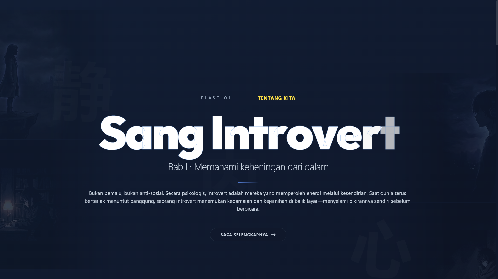
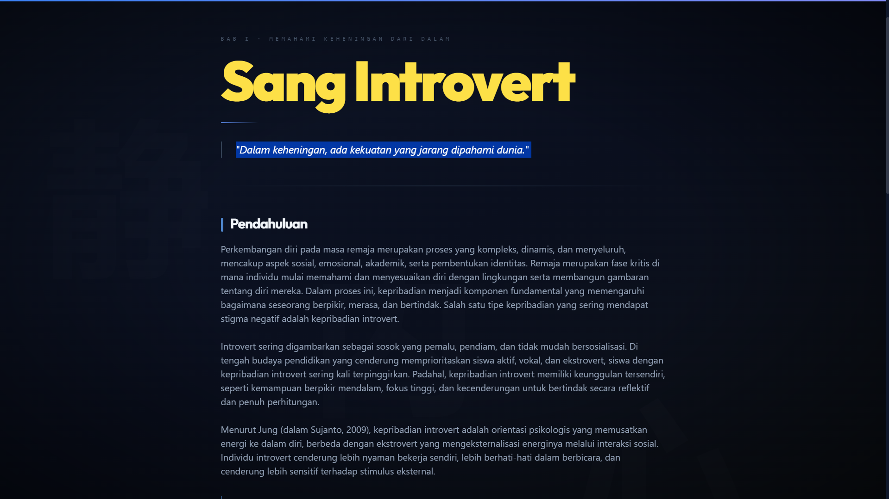

# Sang Introvert


**Sang Introvert** adalah website naratif imersif yang mengubah riset psikologi tentang remaja introvert menjadi pengalaman membaca layaknya novel digital — lengkap dengan animasi ketik, navigasi per bab, dan nuansa sinematik yang kuat.

## 📸 Preview

<p>
  
  
</p>

## 📌 Deskripsi Project

Website ini menyajikan isi jurnal penelitian tentang dampak kepribadian introvert terhadap perkembangan diri remaja dalam format yang mudah dinikmati. Konten dibagi ke dalam bab-bab bertema:

* **Bab I — Sang Introvert:** Pendahuluan dan metodologi penelitian.
* **Bab II — Baterai Sosial:** Dampak sosial dan akademik kepribadian introvert.
* **Bab III — Mitos vs Fakta:** Dampak emosional, keunggulan kompetitif, dan perbandingan penelitian.
* **Bab IV — Kekuatan:** Implikasi praktis, kesimpulan, dan saran.
* **Ruang Cerita:** Kisah nyata dari introvert lain yang bisa di-swipe.

Sumber: *Muqoddima: Jurnal Pemikiran dan Riset Sosiologi*, Vol. 5 No. 1 (2024) — Ahmad Royani & Nadya Nailal Husna.

## 🛠️ Tech Stack

* **Framework:** Next.js 14 (App Router)
* **Bahasa:** TypeScript
* **Styling:** Tailwind CSS
* **Animasi:** GSAP + Anime.js
* **Font:** Google Fonts (Inter & Outfit)

## 🚀 Fitur Utama

* **Typing Animation:** Setiap paragraf bab muncul karakter per karakter layaknya mesin ketik novel.
* **Scroll-Driven Animations:** Judul dan teks di halaman utama muncul mengikuti scroll menggunakan GSAP ScrollTrigger.
* **Chapter Navigation:** Navigasi antar bab dengan progress bar dan dot indicator.
* **Skip Button:** Tombol untuk langsung menampilkan seluruh teks tanpa menunggu animasi.
* **Floating Kanji:** Karakter Jepang dekoratif yang melayang di background tiap section.
* **Story Card Stack:** Kartu cerita introvert yang bisa di-swipe/tap untuk berganti.
* **Responsive Design:** Tampilan optimal di Desktop, Tablet, dan Mobile.
* **Sumber Referensi:** Daftar pustaka lengkap ditampilkan di akhir setiap bab.

## 📁 Struktur Folder

```text
introvert/
├── public/
│   ├── char1.png          # Gambar karakter anime background
│   ├── char2.png
│   ├── char3.png
│   └── char4.png
├── screenshot/
│   ├── landing_page.png   # Preview halaman utama
│   └── bab1.png           # Preview halaman bab
├── app/
│   ├── globals.css        # Global styles & animasi
│   ├── layout.tsx         # Root layout (font, metadata)
│   ├── page.tsx           # Halaman utama (landing)
│   └── bab/
│       └── [id]/
│           └── page.tsx   # Halaman dinamis per bab
├── components/
│   ├── Main.tsx           # Konten utama landing page (5 section + footer)
│   ├── ChapterView.tsx    # Komponen halaman bab dengan typing animation
│   ├── Scene.tsx          # Background layer
│   └── Background.tsx     # Karakter anime parallax
├── lib/
│   └── chapters.ts        # Data bab, paragraf, referensi, dan sumber jurnal
├── tailwind.config.ts
├── tsconfig.json
└── package.json
```

## ⚙️ Instalasi & Setup

### Prasyarat

* Node.js (versi LTS disarankan)
* NPM

### Langkah Instalasi

1. **Clone Repository**
   ```bash
   git clone https://github.com/Raditt10/introvert.git
   cd introvert
   ```

2. **Instal Dependensi**
   ```bash
   npm install
   ```

3. **Jalankan Mode Development**
   ```bash
   npm run dev
   ```
   Website akan berjalan di `http://localhost:3000`.

4. **Build untuk Production**
   ```bash
   npm run build
   npm start
   ```

## 🤝 Kontribusi

1. Fork repository ini.
2. Buat branch baru.
3. Commit perubahan Anda.
4. Push ke branch tersebut.
5. Buat Pull Request.

## 📄 Lisensi

Project ini dilisensikan di bawah **MIT License**.

---

_© 2025 Hak cipta milik pengembang [Raditt10](https://github.com/Raditt10)._
